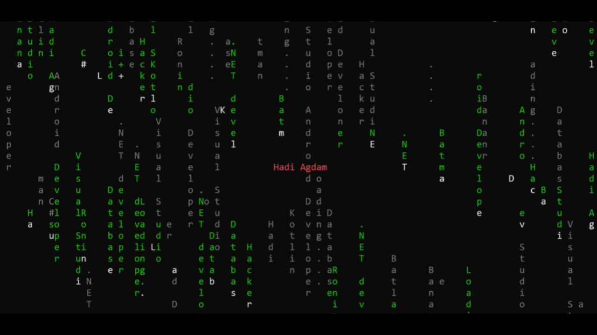

# 🪐 HadiAgdam-Cmatrix

A high-performance, animated digital rain simulation designed purely for the command line interface (CLI), built using C#. 

## ⚡ Features

* **Fluid Animations:** Designed with smooth text rendering techniques optimized for the standard console window.
* **Pure C# / .NET:** Built without bloated dependencies, maximizing performance natively.
* **Lightweight:** Low memory footprint, keeping terminal interactions incredibly responsive.

